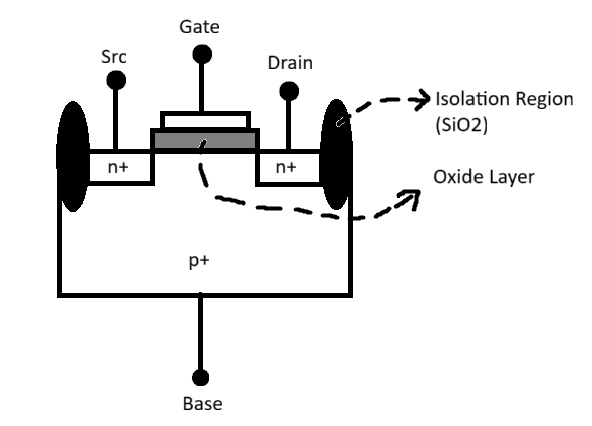
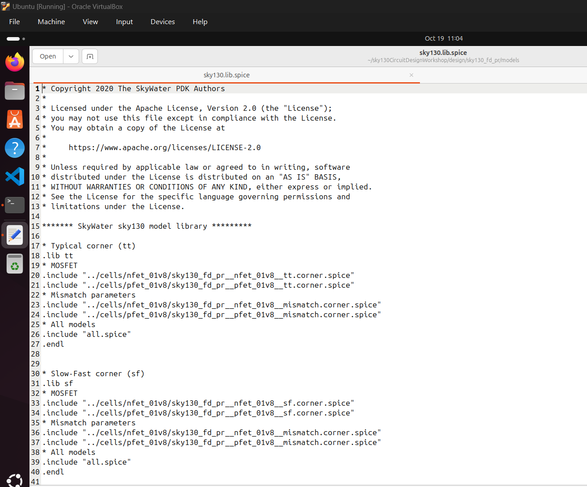
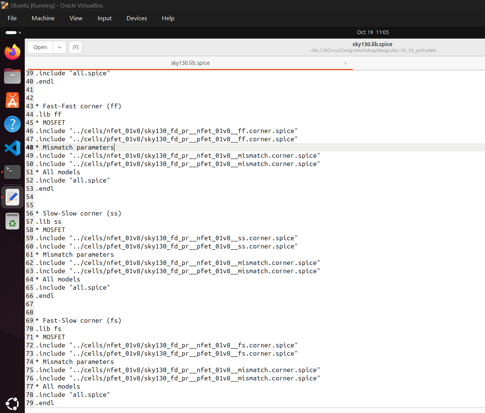
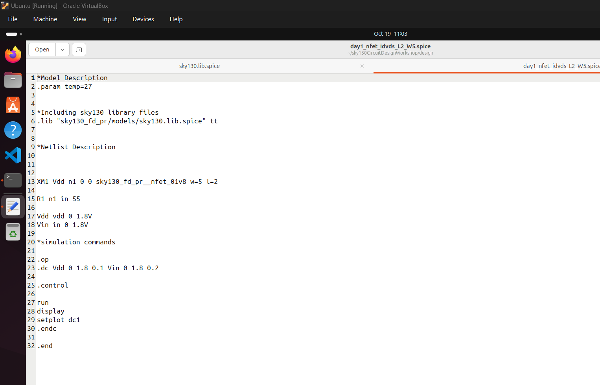
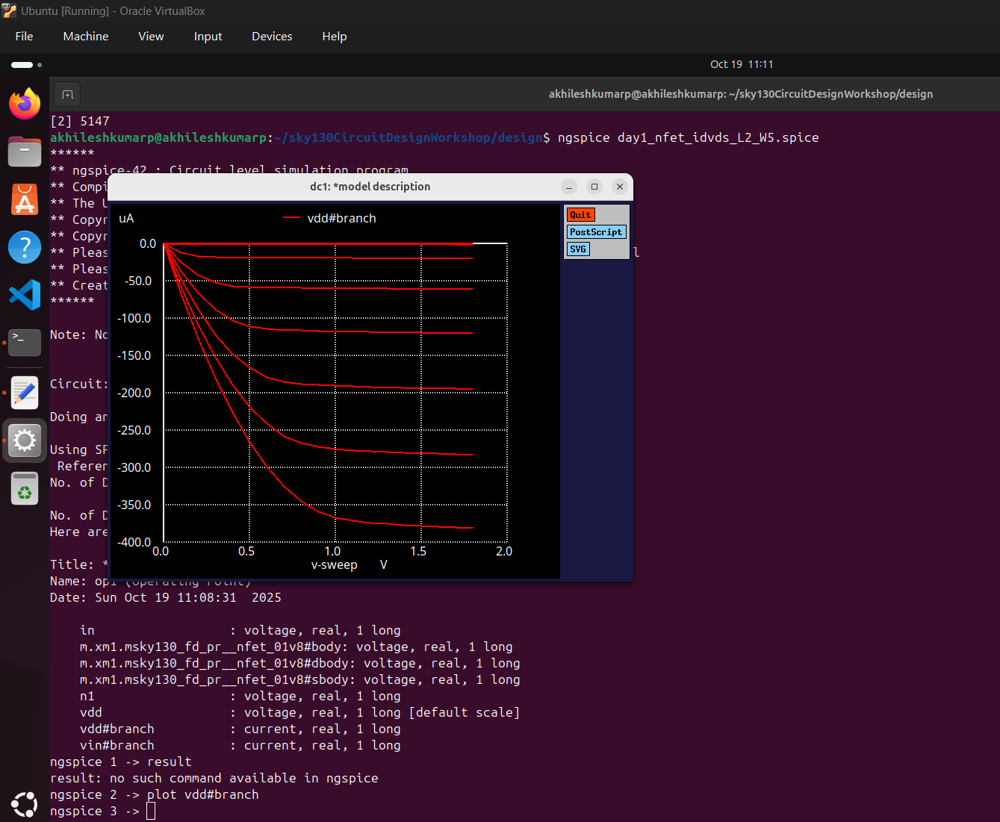
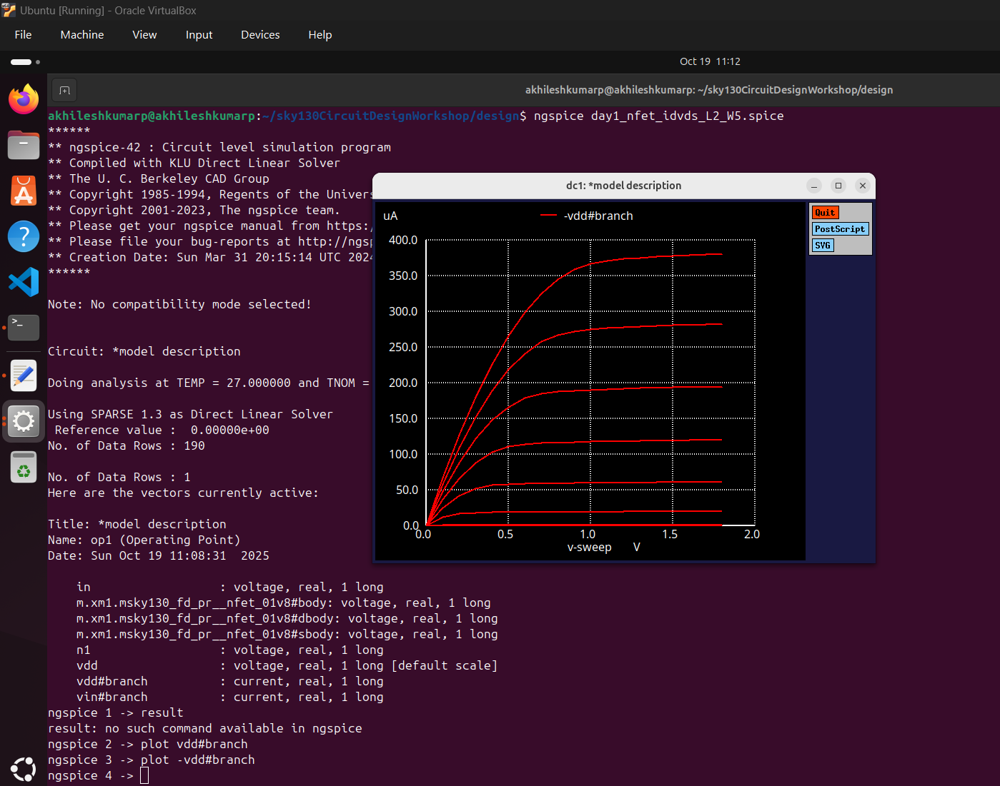

# Day 1: Fundamentals of Circuit Design and SPICE Simulation

## Overview
This document provides a comprehensive introduction to circuit design fundamentals, focusing on NMOS transistor operation, device physics, and SPICE simulation methodology. We explore the theoretical foundations necessary for understanding MOSFET behavior and introduce practical simulation techniques used in modern IC design.

## NMOS Transistor Architecture and Operation

### Device Structure
The NMOS (N-channel Metal-Oxide-Semiconductor) transistor is a fundamental building block in modern digital circuits. It consists of four primary terminals:

- **Gate (G)**: Made of polysilicon, controls the channel formation
- **Source (S)**: N+ doped region, supplies carriers to the channel  
- **Drain (D)**: N+ doped region, collects carriers from the channel
- **Bulk/Substrate (B)**: P+ doped region, provides the foundation

The device is constructed on a P-type substrate with N+ source and drain regions. A thin oxide layer separates the polysilicon gate from the channel region, providing electrical isolation while allowing electrostatic control.



### Physical Operation Principles

The NMOS transistor operates based on the principle of field-effect control. When appropriate voltages are applied to the terminals, an electric field created by the gate voltage modulates the conductivity of the channel region beneath the gate oxide.

**Key Operating Mechanism:**
1. **Channel Formation**: When VGS exceeds the threshold voltage, mobile electrons are attracted to the gate-oxide interface
2. **Current Conduction**: These electrons form a conductive channel connecting source and drain
3. **Current Modulation**: The gate voltage controls the channel conductivity and hence the drain current

## Threshold Voltage Analysis

### Basic Threshold Voltage Concept
The threshold voltage (Vth) represents the minimum gate-to-source voltage required to create a conductive channel between source and drain terminals. This parameter is critical for determining when the transistor transitions from the "off" state to the "on" state.

### Impact of Source-to-Body Voltage (Vsb)

When a voltage difference exists between the source and body terminals, it significantly affects the threshold voltage. This phenomenon is known as the **body effect** or **back-gate effect**.

**Physical Mechanism:**
- Positive Vsb increases the depletion region width
- More gate voltage is required to achieve strong inversion
- The effective threshold voltage increases

**Mathematical Relationship:**
```
Vth = Vth0 + γ(√(2φF + Vsb) - √(2φF))
```

Where:
- **Vth0**: Threshold voltage at zero body bias
- **γ**: Body effect coefficient (depends on process parameters)
- **φF**: Fermi potential
- **Vsb**: Source-to-body voltage

### Body Effect Coefficient
The body effect coefficient γ is given by:
```
γ = (√(2qεsiNA))/(Cox)
```

Where:
- **q**: Elementary charge
- **εsi**: Silicon permittivity
- **NA**: Acceptor doping concentration
- **Cox**: Gate oxide capacitance per unit area

## Operating Regions of NMOS Transistors

### 1. Cut-off Region
**Condition**: VGS < Vth

In this region, no conducting channel exists between source and drain. The transistor acts as an open switch with minimal leakage current flowing between terminals.

**Characteristics:**
- Negligible drain current (ID ≈ 0)
- High drain-to-source resistance
- Device is effectively "off"

### 2. Linear (Triode) Region  
**Condition**: VGS > Vth AND VDS < (VGS - Vth)

The transistor operates as a voltage-controlled resistor. The channel exists along the entire gate length, and current flow is proportional to the drain-source voltage.

**Current Equation Derivation:**

Starting with the gradual channel approximation, the local channel voltage V(x) varies from 0 (at source) to VDS (at drain).

The charge density at position x: 
```
Q(x) = -Cox[VGS - Vth - V(x)]
```

The current density:
```
J = μnQ(x)E(x) = μnQ(x)(dV/dx)
```

Integrating along the channel length:
```
ID = (μnCox)(W/L)[VGS - Vth - VDS/2]VDS
```

Where:
- **μn**: Electron mobility
- **W**: Channel width
- **L**: Channel length

### 3. Saturation Region
**Condition**: VGS > Vth AND VDS ≥ (VGS - Vth)

In saturation, the channel is pinched off near the drain end. Further increases in VDS do not significantly increase the drain current, making it relatively independent of VDS.

**Current Equation:**
```
ID = (1/2)(μnCox)(W/L)(VGS - Vth)²(1 + λVDS)
```

The term (1 + λVDS) accounts for **channel length modulation**, where λ is the channel length modulation parameter.

**Physical Explanation:**
- Channel pinch-off occurs when VDS = VGS - Vth
- Effective channel length decreases with increasing VDS
- Current saturates but shows slight dependence on VDS due to channel length modulation

## Introduction to SPICE Simulation

### What is SPICE?
SPICE (Simulation Program with Integrated Circuit Emphasis) is the industry-standard circuit simulation tool used for analyzing electronic circuits. It employs mathematical models to predict circuit behavior under various operating conditions.

**Key Capabilities:**
- **DC Analysis**: Static operating point calculations
- **AC Analysis**: Frequency domain analysis
- **Transient Analysis**: Time-domain circuit response
- **Noise Analysis**: Circuit noise characteristics

### SPICE Netlist Structure

A SPICE netlist describes the circuit topology, component values, and simulation parameters in a text-based format.

**Basic Syntax Rules:**
1. Each line represents a circuit element or command
2. Node names can be alphanumeric
3. Ground node is typically labeled as '0'
4. Comments begin with '*' or are enclosed in text lines

### NMOS Device Declaration in SPICE

**Syntax:**
```
M<name> <drain> <gate> <source> <bulk> <model_name> W=<width> L=<length>
```

**Example:**
```
M1 vdd n1 0 0 nmos W=1.8u L=1.2u
```

This declares an NMOS transistor named M1 with:
- Drain connected to node 'vdd'
- Gate connected to node 'n1'  
- Source connected to ground ('0')
- Bulk connected to ground ('0')
- Using model 'nmos'
- Width = 1.8 micrometers
- Length = 1.2 micrometers

### Complete SPICE Netlist Example

```spice
* NMOS Characterization Circuit
M1 vdd n1 0 0 nmos W=1.8u L=1.2u
R1 in n1 55
VDD vdd 0 2.5
Vin in 0 2.5

* Include process models
.include "nfet.spice"
.include "sky130_models.spice"

* DC Analysis
.dc Vin 0 2.5 0.1

* Simulation Control
.control
run
plot id(M1)
.endc

.end
```

### Understanding SPICE Model Files

**Process Models**: Define device physics parameters for specific technology nodes
- Threshold voltage parameters
- Mobility values  
- Process variation corners (typical, fast, slow)
- Temperature coefficients



**Sky130 Process**: Open-source 130nm technology providing:
- Complete device models (NMOS, PMOS, resistors, capacitors)
- Multiple process corners for design verification
- Industry-standard SPICE compatibility

### Running SPICE Simulations

**Using ngspice (Open-source SPICE):**

1. **Launch ngspice**: `ngspice netlist.spice`
2. **Interactive mode**: Use `.control` blocks for command sequences
3. **Plotting results**: `plot <signal_name>` for waveform display
4. **Data extraction**: Use measurement commands for parameter extraction

**Example Commands:**
```spice
.control
dc Vin 0 2.5 0.01
plot id(M1) vs v(in)
print id(M1)
.endc
```

 

### Interpreting Simulation Results



With proper branch analysis, we can see the characteristic curves:

 
**ID vs VDS Characteristics:**
- **Linear region**: Current increases linearly with VDS
- **Saturation region**: Current becomes relatively constant
- **Process variations**: Multiple curves for different corners

**Key Parameters to Extract:**
- Threshold voltage (Vth)
- Transconductance (gm = ∂ID/∂VGS)
- Output conductance (gds = ∂ID/∂VDS)
- Channel length modulation parameter (λ)

## Practical Considerations

### Device Sizing Guidelines
- **W/L ratio**: Determines current drive capability
- **Minimum dimensions**: Limited by process technology rules
- **Matching requirements**: Critical for analog circuit design

### Process Variations
- **Global variations**: Affect entire wafer uniformly
- **Local variations**: Random variations within small areas
- **Design margins**: Account for process, voltage, temperature (PVT) variations

### Model Accuracy
- **Long-channel models**: Valid for L > 5-10 × minimum length
- **Short-channel effects**: Require advanced models for modern technologies
- **Temperature dependence**: Models include thermal effects

## Summary

This introduction to NMOS transistors and SPICE simulation provides the foundation for understanding:
- Physical operation of MOSFET devices
- Threshold voltage behavior and body effect
- Current-voltage relationships in different operating regions
- SPICE simulation methodology and netlist construction
- Practical considerations for circuit design

These concepts form the basis for more advanced topics including CMOS inverter design, noise analysis, and process optimization covered in subsequent days.

## Key Takeaways

1. **Threshold voltage** is the critical parameter determining transistor switching
2. **Body effect** significantly impacts threshold voltage in practical circuits
3. **Operating regions** define the transistor's electrical behavior
4. **SPICE simulation** is essential for circuit verification and optimization
5. **Device models** must accurately represent physical behavior for reliable design

---

*Continue to Day 2 for advanced SPICE analysis techniques and channel length effects.*