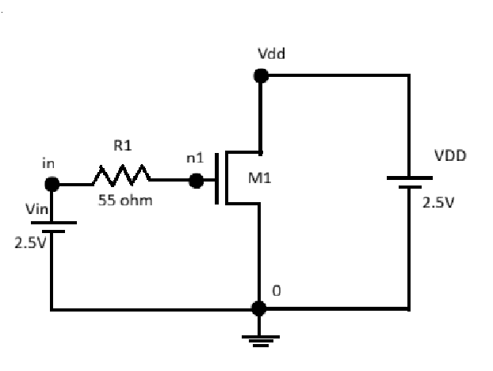
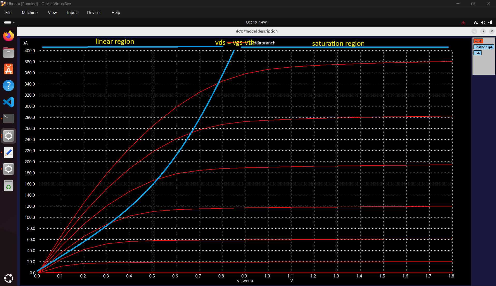
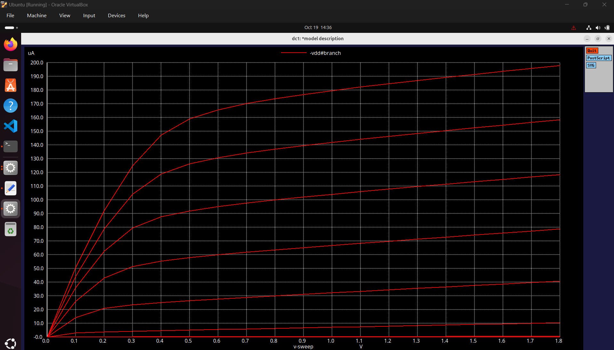
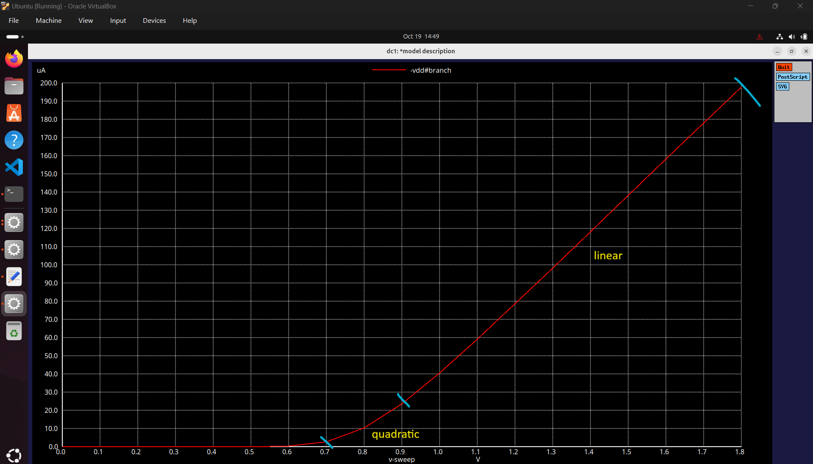
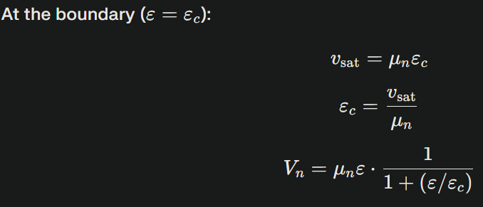
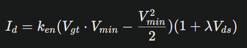
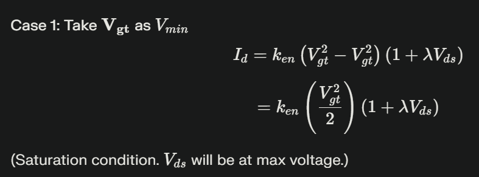
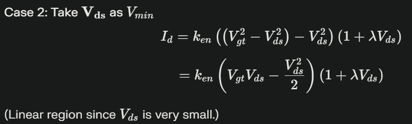
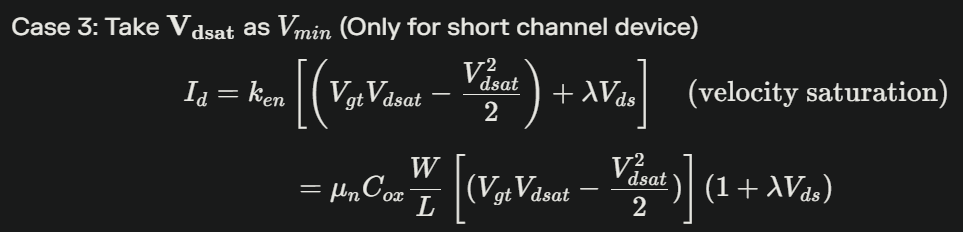

# Day 2: Advanced SPICE Analysis and Channel Length Effects

## Overview
This document gives a brief description on how the drain current `Id` is a function of gate-to-source voltage `VGS` and how the drain current is affected by transistor sizing. It compares the output waveforms obtained from the spice simulation of a long-channel and a short-channel MOSFET. We also discuss how in a short-channel MOSFET, there are four regions of operation and discuss the drain current formula for each. The second part of the document consists of deriving the voltage transfer characteristics (VTC) of a CMOS invertor step by step, while keeping in mind that the main focus of study is characterizing the MOS device as a switch.

# SPICE simulation 
Upon simulation of the circuit shown below - 


The following waveform was obtained 


The below waveform mentions the regions of operation for the same NMOS device simulated, where the green line indicates `Edge of Saturation` that is when VDS = VGS - Vth.


The simulation is performed on a NMOS MOSFET that has characteristics W = 5u and L = 2u (considered as long-channel MOSFET), whose W/L value is 2.5. We are going to compare with another device with same W/L value close to 2.5 but that actual values of W = 0.39u and L = 0.18u. 

**Expectation** Since the W/L values are somewhat simlar, the outputs will be same. 
**Reality** The output waveforms are going to be different and we are going to plot them and make observations do decode this mystery. 

Upon simulation of the same SPICE netlist, but with a short channel MOSFET, the simulation results are are shown below - 


## Observations
### Long Channel MOSFET 
**ID vs VGS for Long Channel MOSFET**
*Note: LC_ID_vs_VGS.png image is missing from assets folder*
<!--  -->
- The drain current `Id` has a quadratic dependence on gate voltage `VGS` 
- The peak saturation current observed is 380 uA. This indicates that saturation happens slower in long-channel devices.

### Short Channel MOSFET 
**ID vs VGS for Short Channel MOSFET**

- The drain current `Id`, initially has a quadratic dependence on gate voltage `VGS` (for lower values of VGS). After the initial point, Id is linear in nature. This is due to velocity saturation.
## Velocity Saturation 
The condition where, for lower values of electric field, the velocity tends to be a linear function of electric field but after a certain point, it becomes constant due to scattering effect is called as 
**Velocity Saturation**. 


The derivation for drain current due to veolocity saturation is given below. We try to derive the equations at boundry condition where ε=εc.




Using these values in the standard drain current equation, we get the following:


The above derived equation is complex in nature, so we try to simplify it in the next section

## Regions of Operation 
As mentioned before, in a short-channel MOSFET, there are 4 regions of operation, Cut-off, Linear, Velocity Saturation and Saturation. 
The cut-off region for both long-channel and short-channel devices are the same as they remain in the off-state (VGS<0). For the remaining regions, we are going to take a model of drain current as shown below:



We are considering VGS-Vth = Vgt.\
Where Vmin = min(Vgt,Vds,Vdsat).\
Vdsat can be defined as the voltage at which, the device velocity saturates and becomes independent of VGS or Vds. Upon substituting each value as minimum in the above drain current equation, here is what we get.





# CMOS Veolocity Transfer Characteristics (VTC)
In this section we are going to look at a MOS device from a switch point of view. A transistor can be called as a switch with inifinite OFF resistance and finite ON resistance. We know that, a MOS transistor is on only when |VGS|>=|Vth| (Considering both NMOS and PMOS device).


## CMOS Inverter 
CMOS - Complementary Metal Oxide Semiconductor, utilizes complementary and symmetrical pairs of p-type and n-type MOSFETs to perform logic functions, resulting in low static power consumption and high noise immunity. 


We will assign a few naming conventions such as -
- VGSp - Voltage between gate and source for PMOS
- VGSn - Voltage between gate and source for NMOS
- VDSp - Voltage between drain and source for PMOS
- VDSn - Voltage between drain and source for NMOS 
- IDSn - Current between drain and source for NMOS
- IDSp - Current between draina and source for PMOS

### Case 1
When Vin is high and equal to Vdd - 
- PMOS is in OFF state
- NMOS is on ON state
- The capacitor discharges and Vout = 0


### Case 2
When Vin is low and equal to 0 -
- PMOS is in ON state
- NMOS is in OFF state
- The capacitor charges and Vout = Vdd


## Observations Made
- VGSn = Vin
- VDSn = Vout
- VGSp = Vin - Vdd
- VDSn = Vout - Vdd
- IDSp = -IDSn 

### ID vs VGS Plots for Transistors 


**Steps to Obtain VTC of Inverter**
VTC is purely a function of voltages, so we convert the above waveforms with values of only Vin and Vout.
#### 1. Finding Load Curve for PMOS 
Assuming the value of Vdd to be 2V and VGSp is from 0V to 2V with a step of 0.5V, we can create the table 

| VGSp         | V            | Vin = VGSp + Vdd    |
| ------------ | ------------ | ------------------- |
| VGSp1        | 0            | 2                   |
| VGSp2        | -0.5         | 1.5                 |
| VGSp3        | -1           | 1                   |
| VGSp4        | -1.5         | 0.5                 |
| VGSp5        | -2           | 0                   |

Here, we have converted the VGSp values in terms of Vin. We are going to do the same for the PMOS waveform too 


Next we are going to convert the x-axis from VDSp to Vout. For that we have to shift the x-axis by a value Vdd. 


The above graph shows the load curve for the PMOS in CMOS inverter. 

#### 2. Finding Load Curve for NMOS
Finding the load curve for a NMOS transistor is a CMOS inverter is simpler that finding for PMOS. We simply replace the values of VGSn with Vin values and x-axis VDSn with Vout. 


| VGSn         | V            | Vin = VGSp + Vdd    |
| ------------ | ------------ | ------------------- |
| VGSn1        | 0            | 0                   |
| VGSn2        | 0.5          | 0.5                 |
| VGSn3        | 1            | 1                   |
| VGSn4        | 1.5          | 1.5                 |
| VGSn5        | 2            | 2                   |


#### 3. Super impose NMOS load curve on PMOS load curve
Now we just have to super impose the NMOS load curve on PMOS load curve and find points of intersection and find the final Vin-Vout waveform. 


| Vin NMOS     | Vin PMOS     | Vout                | NMOS Region of Operation | NMOS Region of Operation|
| ------------ | ------------ | ------------------- | ------------------------ | ----------------------- |
| 2            | 0            | 0                   | Linear                   | Cut-off                 |
| 1.5          | 0.5          | 0<Vout<0.5          | Linear                   | Saturation              |
| 1            | 1            | 0.5<Vout<1          | Saturation               | Saturation              |
| 0.5          | 1.5          | 1<Vout<1.5          | Saturation               | Linear                  |
| 0            | 2            | 2                   | Cut-off                  | Linear                  |

Upon identifying the intersection points, (Vin PMOS, Vin NMOS) where they are similar, we have plotted the following VTC curve. 


Thus we have plotted the VTC plot of a CMOS inverter.

### Long-Channel MOSFET Behavior

**ID vs VGS Characteristics:**
- **Quadratic dependence**: ID ∝ (VGS - Vth)² in saturation region
- **Smooth transition**: Gradual change between linear and saturation regions
- **Higher saturation current**: Peak current ~380μA due to larger device dimensions
- **Ideal MOSFET behavior**: Follows classical long-channel theory

**Key Observations:**
1. Clean quadratic relationship in saturation region
2. Well-defined threshold voltage
3. Predictable current-voltage behavior
4. Minimal short-channel effects

### Short-Channel MOSFET Behavior

**ID vs VGS Characteristics:**
- **Initial quadratic region**: Classical behavior at low VGS
- **Linear region**: Transition to linear dependence at higher VGS
- **Lower saturation current**: Peak current ~198μA
- **Velocity saturation effects**: Deviation from ideal quadratic law

**Key Observations:**
1. Non-ideal current-voltage relationship
2. Early onset of velocity saturation
3. Reduced transconductance at high gate voltages
4. Process-dependent behavior variations

## Velocity Saturation in Short-Channel Devices

### Physical Mechanism

Velocity saturation occurs when the carrier velocity reaches a maximum value despite increasing electric field strength. This phenomenon is particularly prominent in short-channel devices where high electric fields are present.

**Velocity-Field Relationship:**
```
v = μE / (1 + E/Ec)
```

Where:
- **v**: Carrier velocity
- **μ**: Low-field mobility  
- **E**: Electric field
- **Ec**: Critical electric field (~10⁴ V/cm for electrons in silicon)

### Impact on Current-Voltage Characteristics

**Traditional (Long-Channel) Current Equation:**
```
ID = (1/2) μn Cox (W/L) (VGS - Vth)²
```

**Velocity-Saturated (Short-Channel) Current:**
```
ID = Cox W vsat (VGS - Vth)
```

Where **vsat** is the saturated carrier velocity (~10⁷ cm/s for electrons).

### Derivation of Velocity-Saturated Current

At the critical field condition (E = Ec), the drain voltage becomes:
```
VDSsat = (VGS - Vth) / (1 + (VGS - Vth)/(Ec × L))
```

For strong velocity saturation (VGS - Vth >> Ec × L):
```
VDSsat ≈ Ec × L
```

The saturated current becomes:
```
ID_sat = Cox W vsat (VGS - Vth)
```

This explains the linear dependence of ID on VGS in velocity-saturated devices.

## Four-Region Model for Short-Channel MOSFETs

### Enhanced Operating Region Classification

For accurate modeling of short-channel devices, we extend the traditional three-region model to include velocity saturation:

1. **Cut-off Region**: VGS < Vth
2. **Linear Region**: VGS > Vth, VDS < min(VGS-Vth, VDSsat)
3. **Velocity Saturation Region**: VGS > Vth, VDSsat < VDS < VGS-Vth  
4. **Current Saturation Region**: VGS > Vth, VDS > VGS-Vth

### Unified Current Model

```
ID = μn Cox (W/L) Vmin² / (2 + Vmin/VDSsat)
```

Where: **Vmin = min(VGS-Vth, VDS, VDSsat)**

**Case Analysis:**

**Case 1: Linear Region (Vmin = VDS)**
```
ID = μn Cox (W/L) VDS² / (2 + VDS/VDSsat)
≈ μn Cox (W/L) VDS (VGS-Vth - VDS/2)  [for VDS << VDSsat]
```

**Case 2: Velocity Saturation (Vmin = VDSsat)**  
```
ID = μn Cox (W/L) VDSsat² / (2 + 1)
= μn Cox (W/L) VDSsat² / 3
```

**Case 3: Current Saturation (Vmin = VGS-Vth)**
```
ID = μn Cox (W/L) (VGS-Vth)² / (2 + (VGS-Vth)/VDSsat)
```

## CMOS Inverter Foundation Theory

### Transistor as a Switch

From a digital circuit perspective, MOSFETs function as voltage-controlled switches with:
- **Infinite OFF resistance**: When VGS < Vth
- **Finite ON resistance**: When VGS > Vth
- **Ron = 1/(μn Cox (W/L) (VGS-Vth))**: In linear region

### CMOS Inverter Configuration

A CMOS inverter consists of complementary NMOS and PMOS transistors:
- **NMOS**: Pull-down network (connects output to ground)
- **PMOS**: Pull-up network (connects output to VDD)
- **Complementary operation**: Only one device conducts at a time

### Terminal Voltage Relationships

**NMOS Transistor:**
- VGSn = Vin  
- VDSn = Vout
- VBSn = 0 (body tied to ground)

**PMOS Transistor:**
- VGSp = Vin - VDD
- VDSp = Vout - VDD  
- VBSp = 0 (body tied to VDD)

**Current Relationship:**
```
IDSp = -IDSn  (Kirchhoff's current law at output node)
```

### Operating State Analysis

**Case 1: Vin = VDD (Logic High Input)**
- NMOS: VGSn = VDD > Vthn → ON
- PMOS: VGSp = 0 > Vthp → OFF  
- Output: Vout = 0 (Logic Low)
- Load capacitor discharges through NMOS

**Case 2: Vin = 0 (Logic Low Input)**
- NMOS: VGSn = 0 < Vthn → OFF
- PMOS: VGSp = -VDD < Vthp → ON
- Output: Vout = VDD (Logic High)  
- Load capacitor charges through PMOS

## Voltage Transfer Characteristic (VTC) Development

### Graphical Construction Method

The VTC curve represents the relationship between input voltage (Vin) and output voltage (Vout) for the CMOS inverter. It can be constructed by superimposing the load curves of NMOS and PMOS devices.

### PMOS Load Curve Transformation

Starting with PMOS ID-VDS characteristics for different VGS values:

**Step 1: Convert VGS to Vin**
```
VGSp = Vin - VDD  →  Vin = VGSp + VDD
```

**Step 2: Convert VDS to Vout**  
```
VDSp = Vout - VDD  →  Vout = VDSp + VDD
```

**Step 3: Current Direction**
```
IDSp = -IDSn  (due to current direction convention)
```

### NMOS Load Curve

Direct mapping from device characteristics:
- **VGSn → Vin** (direct substitution)
- **VDSn → Vout** (direct substitution)  
- **IDSn → IDSn** (no change)

### Finding Intersection Points

The VTC is constructed by finding intersection points where:
```
IDSn(Vin, Vout) = -IDSp(Vin, Vout)
```

For each value of Vin, solve for Vout where currents balance.

### Operating Region Analysis

| Vin Range | NMOS Region | PMOS Region | Output State |
|-----------|-------------|-------------|--------------|
| 0 to Vthn | Cut-off | Linear | VOH |
| Vthn to Vm | Saturation | Linear | Transition |
| Vm to VDD-|Vthp| | Saturation | Saturation | Transition |
| VDD-|Vthp| to VDD | Linear | Cut-off | VOL |

Where **Vm** is the switching threshold voltage.

## Design Implications and Trade-offs

### Channel Length Selection

**Long-Channel Advantages:**
- Predictable device behavior
- Better matching characteristics
- Lower process sensitivity
- Ideal for analog circuits

**Short-Channel Advantages:**  
- Higher integration density
- Faster switching speeds (when properly designed)
- Lower capacitance
- Essential for advanced technologies

**Design Challenges:**
- Velocity saturation limits performance scaling
- Increased process variations
- Complex modeling requirements
- Leakage current concerns

### Performance Optimization Strategies

1. **Device Sizing**: Optimize W/L ratios for target performance
2. **Process Selection**: Choose appropriate channel length for application
3. **Circuit Topology**: Use velocity saturation effectively in design
4. **Model Validation**: Verify SPICE models against measured data

## Summary

This analysis reveals fundamental differences between long and short-channel MOSFET behavior:

1. **Classical vs. Modern**: Long-channel devices follow ideal theory; short-channel devices exhibit velocity saturation
2. **Current Scaling**: Linear relationship replaces quadratic in velocity-saturated regime
3. **Design Complexity**: Short-channel devices require more sophisticated modeling
4. **CMOS Foundation**: Understanding individual device behavior is essential for inverter analysis

The transition from quadratic to linear current dependence in short-channel devices fundamentally changes circuit design strategies and performance optimization approaches.

## Key Takeaways

- **Velocity saturation** significantly alters MOSFET I-V characteristics in modern technologies
- **Channel length effects** must be considered in contemporary circuit design
- **SPICE modeling** requires accurate physical models for design reliability
- **CMOS inverter behavior** depends critically on individual transistor characteristics
- **Performance trade-offs** exist between device scaling and predictable behavior

---

*Continue to Day 3 for detailed VTC simulation methodology and timing analysis.*