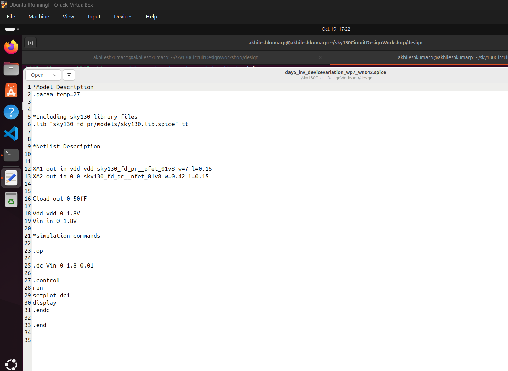

# Day 5: Power Scaling and Process Variation Analysis

## Overview
This document provides a comprehensive analysis of power scaling techniques and process variation effects in CMOS circuit design. We explore how supply voltage variations impact gain, energy consumption, and performance trade-offs, while examining the robustness of CMOS inverters under fabrication-induced device variations. The study combines theoretical insights with practical SPICE simulations to understand the fundamental design challenges in modern semiconductor technologies.

# 📘 Introduction to CMOS Gain, Energy, and Delay Trade-offs

This section explores how **supply voltage, gain, and dynamic behavior** impact the performance of CMOS circuits. The discussion combines theoretical insights that will be validated through **SPICE simulations**.

## ⚙️ Key Concepts

### Gain and Slope Relationship
- A **sharper VTC (Voltage Transfer Characteristic) slope** corresponds to a **higher gain**
- Higher gain improves **noise margins** and **signal integrity** in digital circuits
- However, extremely steep slopes can lead to **stability issues** and **slower transient response**

### Supply Voltage and Gain Trade-off
- **Lowering the supply voltage (VDD)** can sometimes **increase gain by ~50%** in analog regions
- This occurs because transistors operate closer to their threshold voltage
- However, operating near threshold may **degrade switching speed** or even **cause functional failure**

### Power Dissipation Dependency
- The **dynamic power** in CMOS is given by: **P = ½ × C × V² × f**
- Reducing supply voltage from **5V to 2.5V** results in about **96% reduction in dynamic power** (since *P ∝ V²*)
- Example: **(2.5 / 5)² = 0.25 → 75% less power per transition**
- When combined with lower switching activity, the **total energy saving can reach up to ~96%**

### Impact on Delay and Performance
- Lower VDD leads to **slower transistor switching** due to reduced drive current
- This increases **rise and fall times**
- In extreme cases, the circuit **may fail to switch completely**, causing **logic errors**

### Key Takeaway
- ⚡ *Sharper slope → Higher gain*
- 🔋 *Lower VDD → Lower energy consumption*
- 🐢 *But → Longer rise/fall times → Slower or unstable operation*

## 🧠 Summary Table

| Parameter            | Effect of Lower VDD | Observation                        |
|----------------------|--------------------:|------------------------------------|
| **Gain**             | ↑ ~50%             | Sharper transition slope           |
| **Energy Dissipation** | ↓ ~96%           | Lower dynamic power consumption    |
| **Delay (Rise/Fall)** | ↑                 | Slower switching                   |
| **Performance**       | ↓                 | May affect logic levels            |
| **Reliability**       | ⚠️                | May fail near threshold operation  |

> **Takeaway:**  
> Sharper slope gives higher gain, and lower voltage reduces energy —  
> but both can degrade switching speed and device reliability.  
> These trade-offs form the foundation of CMOS analog and digital design optimization.

# Power Scaling Analysis

Power scaling is a critical factor that determines the robustness and efficiency of CMOS inverters. As technology nodes shrink, the power supplied to circuits reduces significantly, requiring careful analysis of performance trade-offs.

## LAB: Supply Voltage Variation Analysis

The following SPICE simulation demonstrates the behavior of CMOS inverters across different supply voltages:

```bash
*Model Description
.param temp=27

*Including sky130 library files
.lib "sky130_fd_pr/models/sky130.lib.spice" tt

*Netlist Description
XM1 out in vdd vdd sky130_fd_pr__pfet_01v8 w=1 l=0.15
XM2 out in 0 0 sky130_fd_pr__nfet_01v8 w=0.36 l=0.15
Cload out 0 50fF
Vdd vdd 0 1.8V
Vin in 0 1.8V
.control
let powersupply = 1.8
alter Vdd = powersupply
	let voltagesupplyvariation = 0
	dowhile voltagesupplyvariation < 6
	dc Vin 0 1.8 0.01
	let powersupply = powersupply - 0.2
	alter Vdd = powersupply
	let voltagesupplyvariation = voltagesupplyvariation + 1
end
plot dc1.out vs in dc2.out vs in dc3.out vs in dc4.out vs in dc5.out vs in dc6.out vs in xlabel "input voltage(V)"
ylabel "output voltage(V)" title "Inveter dc characteristics as a function of supply voltage"
.endc
.end
```

### Simulation Results


**Observations:**
- Results show distinct curve characteristics for each voltage level
- Lower voltage curves appear sharper, resulting in higher gain for small input voltage changes
- The curves preserve their characteristic shape across variations, making the design robust for modeling and wide applications


**Gain Calculation:**
- Gain calculation using the curve: (Y02 - Y01) / (X01 - X02) = 8.15
- Lower supply voltages demonstrate improved gain characteristics
- However, insufficient supply voltage prevents complete charging/discharging within standard rise times

### Power Scaling Results Analysis

| Supply Voltage (V) | Gain |Av| | Energy (1/2CV²) (fJ) |
|--------------------|----------|---------------------|
| 1.8                | 9.18     | 0.81                |
| 1.6                | 9.20     | 0.64                |
| 1.4                | 9.19     | 0.49                |
| 1.2                | 10.30    | 0.36                |
| 1.0                | 10.13    | 0.25                |
| 0.8                | 10.08    | 0.16                |

## Advantages of Using Low Power Supply
- **Significant improvement in gain**: Lower voltages result in sharper VTC slopes
- **Dramatic reduction in energy consumption**: Energy scales quadratically with voltage
- **Enhanced noise margins**: Improved signal integrity in digital operations

## Disadvantages of Using Low Power Supply
- **Performance degradation**: Increased time to charge and discharge capacitive loads
- **Reliability concerns**: Operation near threshold voltage may cause functional failures
# Process Variations and Device Robustness

Process variations during fabrication significantly impact CMOS device characteristics and circuit performance. Understanding and mitigating these variations is crucial for robust circuit design.

## Sources of Device Variations

### Etching Process Variations

Etching is a critical fabrication step that defines the physical dimensions of transistor structures, including width and height. Process variations in etching directly impact cell delay and performance characteristics.


The etching process affects the width-to-length (W/L) ratio of transistors, which is fundamental to their electrical characteristics:


**Key Impacts:**
- **Ideal vs. Practical Etching**: Real fabrication shows dimensional variations from designed values
- **W/L Ratio Sensitivity**: Drain current Id is directly proportional to W/L, affecting delay
- **Performance Variations**: Changes in effective channel dimensions impact switching characteristics

### Oxide Thickness (Tox) Variations

During the gate oxide formation process, thickness variations occur across the wafer, particularly affecting devices in different locations:


**Characteristics:**
- **Central vs. Peripheral Devices**: Inverters surrounded by similar devices show less Tox variation
- **Edge Effects**: Devices at chip periphery experience larger oxide thickness variations
- **Electrical Impact**: Tox variations affect threshold voltage and transconductance

## Device Variation Experiments

### Strong vs. Weak Device Configurations

To test CMOS inverter robustness against extreme variations, we analyze configurations with:

**Strong PMOS Configuration:**
- Width: 1.87 microns (widest available, lowest resistance)
- Provides low resistance path for output capacitance charging
- Resistance relationship: R = ρL/A (increased area reduces resistance)

**Weak NMOS Configuration:**
- Width: 0.375 microns (highest resistance)
- Creates asymmetric drive strengths for robustness testing


### LAB: Device Variation Analysis

```bash
*Model Description
.param temp=27
*Including sky130 library files
.lib "sky130_fd_pr/models/sky130.lib.spice" tt
*Netlist Description
XM1 out in vdd vdd sky130_fd_pr__pfet_01v8 w=7 l=0.15
XM2 out in 0 0 sky130_fd_pr__nfet_01v8 w=0.42 l=0.15
Cload out 0 50fF
Vdd vdd 0 1.8V
Vin in 0 1.8V
*simulation commands
.op
.dc Vin 0 1.8 0.01
.control
run
setplot dc1
display
.endc
.end
```

### Simulation Results and Analysis



**Observations from VTC Analysis:**
- **Switching Threshold Shift**: Vm shifts from 0.9V to 0.988V due to stronger PMOS
- **Drive Strength Imbalance**: PMOS drive strength much higher than NMOS
- **Curve Characteristics**: Strong hold in VDD region due to large PMOS size


### Robustness Assessment


**Critical Findings:**
- **Minimal Vm Shift**: Switching threshold variation is small, ensuring continued inverter operation
- **Noise Margin Preservation**: Variations in noise margins remain within acceptable limits
- **Operational Integrity**: CMOS inverter maintains its intended behavior despite extreme device variations


**Key Robustness Indicators:**
- **Acceptable Noise Margin Variation**: Changes in NMH and NML remain manageable
- **Undefined Region Impact**: Higher gain in transition region requires careful consideration
- **Wide Application Suitability**: Robust operation across device variations enables diverse applications

## Systematic Variation Analysis

### W/L Sweeping Methodology


**Experimental Approach:**
- Systematic variation of NMOS and PMOS widths
- Analysis of Vm shift and noise margin changes
- Evaluation of inverter robustness across process corners

### Inverter Chain Analysis


**Chain Configuration Benefits:**
- **Realistic Loading**: Each inverter drives the next stage
- **Process Correlation**: Adjacent devices experience similar variations
- **System-Level Impact**: Cumulative effects of variations across multiple stages


**Layout Considerations:**
- **Proximity Effects**: Device matching improves with close placement
- **Gradient Variations**: Systematic variations across large distances
- **Design for Manufacturing**: Layout techniques to minimize variation impact

## Conclusions and Design Guidelines

### Summary of Key Findings

1. **Power Scaling Benefits:**
   - Significant energy reduction (up to 96% with voltage scaling)
   - Improved gain characteristics at lower supply voltages
   - Enhanced noise margins for digital operation

2. **Process Variation Robustness:**
   - CMOS inverters demonstrate strong tolerance to device variations
   - Switching threshold shifts remain minimal even under extreme conditions
   - Noise margins preserve acceptable levels across process corners

3. **Design Trade-offs:**
   - Lower supply voltages improve energy efficiency but may impact performance
   - Device sizing affects robustness but must balance power and speed requirements
   - Process variations require design margins for reliable operation

### Design Recommendations

1. **Supply Voltage Selection:**
   - Consider energy-performance trade-offs for target applications
   - Ensure adequate noise margins at minimum operating voltage
   - Account for process and temperature variations in voltage planning

2. **Device Sizing Strategy:**
   - Balance drive strengths for optimal switching threshold
   - Include margins for process variations in critical paths
   - Use systematic sizing approaches for consistent performance

3. **Robustness Techniques:**
   - Design for worst-case process corners
   - Implement process-tolerant circuit topologies
   - Include built-in compensation mechanisms where necessary

### 📚 Future Considerations

**Advanced Topics for Further Study:**
- Dynamic behavior under PVT (Process, Voltage, Temperature) variations
- Short-channel effects in deep submicron technologies
- Leakage current impact on static power consumption
- Advanced low-power design techniques (power gating, voltage islands)
- Statistical design methodologies for yield optimization

**Emerging Challenges:**
- FinFET and advanced node process variations
- Aging effects on device characteristics
- Soft error susceptibility in scaled technologies
- Thermal-aware design for high-performance applications

This comprehensive analysis demonstrates that CMOS inverters maintain robust operation across significant process variations and supply voltage changes, making them suitable for a wide range of applications while enabling substantial power savings through appropriate scaling techniques.
* Base circuit configuration
Mn1 vout vin 0 0 nmos W=0.36u L=0.15u
Mp1 vout vin vdd vdd pmos W=1.08u L=0.15u
Cload vout 0 10f

* Parametric voltage sources
VDD vdd 0 {vdd_val}
Vin vin 0 0

* Technology models
.include "sky130_models.spice"

* Parameter sweep
.param vdd_val=1.8
.step param vdd_val 0.8 1.8 0.2

* DC analysis for VTC at each voltage
.dc Vin 0 {vdd_val} 0.01

.control
run
plot vout vs vin
.endc

.end
```

### Voltage Scaling Impact Analysis

**Comprehensive Power Scaling Results:**

| Supply Voltage (V) | Gain |Av| | Energy (fJ) | Performance Impact |
|-------------------|----------|-------------|-------------------|
| 1.8 | 9.18 | 0.81 | Reference performance |
| 1.6 | 9.20 | 0.64 | 21% energy reduction |
| 1.4 | 9.19 | 0.49 | 40% energy reduction |
| 1.2 | 10.30 | 0.36 | 56% energy reduction |
| 1.0 | 10.13 | 0.25 | 69% energy reduction |
| 0.8 | 10.08 | 0.16 | 80% energy reduction |

**Energy Calculation:**
```
E = (1/2) × CL × VDD²
E(1.0V) / E(1.8V) = (1.0²) / (1.8²) = 0.31
```

### Advantages of Low Supply Voltage Operation

**Energy Efficiency:**
- **Dramatic power reduction**: Quadratic scaling with voltage
- **Extended battery life**: Critical for portable devices
- **Reduced heat generation**: Improves reliability and packaging

**Circuit Performance:**
- **Improved gain**: Higher small-signal gain in transition region
- **Better noise margins**: Relative to threshold voltage variations
- **Enhanced linearity**: For analog circuit applications

**System Benefits:**
- **Reduced EMI**: Lower switching noise
- **Improved signal integrity**: Reduced crosstalk and ground bounce
- **Cost reduction**: Simplified power delivery networks

### Disadvantages and Design Challenges

**Performance Degradation:**
- **Increased propagation delay**: Reduced overdrive voltage
- **Lower current drive**: Quadratic reduction in saturation current
- **Reduced noise margins**: Absolute voltage margins decrease

**Reliability Concerns:**
- **Process sensitivity**: Higher relative impact of variations
- **Temperature dependence**: Threshold voltage temperature coefficient
- **Soft error susceptibility**: Reduced critical charge

**Design Complexity:**
- **Multi-VDD design**: Multiple supply domains
- **Level shifters**: Interface between voltage domains
- **Clock distribution**: Timing closure challenges

## Process Variations in Semiconductor Manufacturing

### Sources of Process Variations

Process variations arise from the inherent limitations and tolerances in semiconductor fabrication processes:

**Global Variations:**
- **Wafer-to-wafer**: Systematic variations across different wafers
- **Die-to-die**: Variations across a single wafer
- **Process corner variations**: Slow/fast process extremes

**Local Variations:**
- **Within-die**: Random variations within a single die
- **Device mismatch**: Differences between nominally identical devices
- **Edge effects**: Variations near die edges or process boundaries

### Etching Process Variations

**Physical Mechanism:**

Etching defines critical device dimensions (channel length and width) through:
- **Photolithography**: Pattern definition accuracy
- **Plasma etching**: Anisotropic material removal
- **Critical dimension control**: Line width and spacing control

**Sources of Etching Variation:**

1. **Mask alignment errors**: ±10-20nm typically
2. **Optical proximity effects**: Pattern density dependent
3. **Etch uniformity**: Across-wafer and within-die variations
4. **Loading effects**: Pattern density dependent etch rates
5. **Microloading**: Local pattern density effects

**Impact on Device Parameters:**

**Channel Length Variation (ΔL):**
- **Threshold voltage**: ΔVth ∝ ΔL (short channel effects)
- **Drive current**: ΔID ∝ -ΔL/L (mobility degradation)
- **Leakage current**: Exponential dependence on ΔL

**Channel Width Variation (ΔW):**
- **Drive current**: ΔID ∝ ΔW/W (linear scaling)
- **Parasitic capacitance**: ΔC ∝ ΔW
- **Device matching**: Critical for analog circuits

### Oxide Thickness Variations

**Manufacturing Sources:**

**Chemical-Mechanical Polishing (CMP):**
- **Non-uniform polishing**: Pattern density dependent
- **Dishing and erosion**: Metal line geometry effects
- **Across-wafer variations**: Process uniformity limitations

**Thermal Oxidation:**
- **Temperature uniformity**: ±1-2°C variations
- **Time control accuracy**: Growth rate variations
- **Stress-induced effects**: Non-uniform strain

**Impact on Electrical Parameters:**

**Gate Capacitance Variation:**
```
Cox = εox / Tox
ΔCox/Cox = -ΔTox/Tox
```

**Threshold Voltage Variation:**
```
ΔVth = ΔVfb + Δ(2φF) + ΔQdepl/Cox
```

**Drive Current Impact:**
```
ΔID/ID = ΔCox/Cox + Δμ/μ + ΔVth/(VGS-Vth)
```

### Layout and Proximity Effects

**Isolation Region Impact:**

Devices located near isolation regions experience:
- **Stress effects**: Mechanical stress from STI (Shallow Trench Isolation)
- **Edge effects**: Non-uniform doping profiles
- **Well proximity effects**: Distance from well boundaries

**Dummy Device Strategy:**
- **Surround critical devices** with dummy structures
- **Improve process uniformity** through consistent environment
- **Reduce edge effects** by maintaining pattern density

**Layout Matching Techniques:**
- **Common centroid layout**: Cancels systematic gradients
- **Interdigitated structures**: Improves matching accuracy
- **Guard rings**: Isolates sensitive circuits

## Device Characterization Across Process Corners

### Process Corner Definition

**Corner Nomenclature:**
- **TT (Typical-Typical)**: Nominal process parameters
- **FF (Fast-Fast)**: Fast NMOS, Fast PMOS
- **SS (Slow-Slow)**: Slow NMOS, Slow PMOS
- **FS (Fast-Slow)**: Fast NMOS, Slow PMOS
- **SF (Slow-Fast)**: Slow NMOS, Fast PMOS

**Statistical Representation:**
- **3σ variations**: 99.7% yield coverage
- **Monte Carlo analysis**: Random parameter variations
- **Corner analysis**: Worst-case design verification

### W/L Ratio Sweeping Analysis

**Experimental Design:**

Systematic variation of device sizes to characterize robustness:

```spice
* Process Corner Sweep Analysis
* Device definitions with parametric sizing
Mn1 vout vin 0 0 nmos W={wn_val} L=0.15u
Mp1 vout vin vdd vdd pmos W={wp_val} L=0.15u

* Parameter definitions
.param wn_val=0.36u
.param wp_val=1.08u
.param beta_ratio=3

* Sweep beta ratio (Wp/Wn ratio)
.step param beta_ratio 1 5 0.5

* Include corner models
.lib "sky130_models.spice" tt
.lib "sky130_models.spice" ff  
.lib "sky130_models.spice" ss
.lib "sky130_models.spice" fs
.lib "sky130_models.spice" sf

.dc Vin 0 1.8 0.01

.control
run
plot vout vs vin
.endc
```

### Multi-Corner SPICE Simulation

**Comprehensive Corner Analysis:**

```spice
* Multi-corner analysis script
.temp 27  ; Room temperature

* Nominal analysis
.lib "corners.lib" tt_025
.include "nominal_analysis.spice"

* Fast corner analysis  
.lib "corners.lib" ff_n40
.include "fast_analysis.spice"

* Slow corner analysis
.lib "corners.lib" ss_125
.include "slow_analysis.spice"

* Statistical analysis
.param VARIATION monte=agauss(0,1,3)
.param vth_n_var = agauss(0,0.02,3)
.param vth_p_var = agauss(0,0.02,3)

.mc 1000 .dc Vin 0 1.8 0.01
```

### Process Variation Impact on VTC

**Observable Effects:**

**Switching Threshold Shift:**
- **Fast corner**: Lower Vm due to reduced threshold voltages
- **Slow corner**: Higher Vm due to increased threshold voltages
- **Skewed corners**: Asymmetric Vm shifts

**Gain Variation:**
- **Fast devices**: Higher transconductance, steeper transitions
- **Slow devices**: Lower transconductance, gentler transitions
- **Temperature impact**: Mobility and threshold voltage dependence

**Noise Margin Variation:**
- **Process corners affect VIL, VIH, VOL, VOH differently**
- **Worst-case corners for noise margins identified**
- **Design margins must account for all corners**

### Statistical Design Methodology

**Monte Carlo Analysis:**

```spice
* Monte Carlo simulation setup
.param SEED = 12345
.param NUM_RUNS = 1000

* Parameter variations (Gaussian distribution)
.param vth_n = agauss(0.4, 0.02, 3)
.param vth_p = agauss(-0.4, 0.02, 3)
.param tox = agauss(3.5e-9, 0.1e-9, 3)
.param wn_var = agauss(0.36e-6, 0.01e-6, 3)
.param wp_var = agauss(1.08e-6, 0.03e-6, 3)

.mc NUM_RUNS .dc Vin 0 1.8 0.01

.control
run
let vm_samples = vm_data
histogram vm_samples nbins=50
print mean(vm_samples) variance(vm_samples)
.endc
```

**Yield Analysis:**
- **Specification limits**: Define acceptable parameter ranges
- **Yield calculation**: Percentage of circuits meeting specifications
- **Sensitivity analysis**: Identify critical parameters

### Design for Manufacturing (DFM) Strategies

**Robust Design Principles:**

**Guard-banding:**
- **Design margins**: Include process variation allowances
- **Conservative sizing**: Use larger devices when possible
- **Multiple corner verification**: Ensure functionality across all corners

**Layout Optimization:**
- **Regular structures**: Improve process uniformity
- **Adequate spacing**: Reduce proximity effects
- **Symmetric layout**: Cancel systematic variations

**Circuit Techniques:**
- **Feedback control**: Automatic compensation for variations
- **Calibration circuits**: Post-fabrication trimming
- **Redundancy**: Multiple parallel paths

### Advanced Variation Analysis

**Spatial Correlation:**
- **Systematic variations**: Correlation over distance
- **Random variations**: Uncorrelated local effects
- **Mixed models**: Combination of systematic and random

**Temperature Dependence:**
```
Vth(T) = Vth(T0) + dVth/dT × (T - T0)
μ(T) = μ(T0) × (T/T0)^(-1.5)
```

**Aging Effects:**
- **Hot carrier injection**: Threshold voltage shift
- **Bias temperature instability**: PMOS degradation
- **Time-dependent dielectric breakdown**: Oxide reliability

## Design Guidelines for Robust Circuits

### Systematic Design Approach

**Phase 1: Specification Definition**
- Define target performance across PVT
- Include process variation margins
- Establish yield requirements

**Phase 2: Circuit Design**
- Use appropriate device sizing
- Include guard-banding for critical parameters
- Design for worst-case corners

**Phase 3: Verification**
- Corner analysis simulation
- Monte Carlo yield analysis
- Sensitivity studies

**Phase 4: Layout**
- DFM-compliant layout practices
- Proper device matching
- Stress minimization

### Specific Design Recommendations

**Device Sizing:**
- **Use minimum length**: For speed and area
- **Size for worst-case corner**: Ensure functionality
- **Balance NMOS/PMOS**: Optimize for target metrics

**Circuit Architecture:**
- **Avoid critical dependencies**: Minimize process sensitivity
- **Use differential structures**: Cancel common-mode variations
- **Include tunability**: Post-fabrication adjustments

**Verification Strategy:**
- **Multi-corner simulation**: All PVT combinations
- **Statistical analysis**: Monte Carlo verification
- **Sensitivity analysis**: Critical parameter identification

## Summary

Power scaling and process variation analysis are fundamental to modern IC design:

1. **Supply voltage scaling** provides quadratic power reduction but introduces performance challenges
2. **Process variations** from etching and oxide thickness affect all device parameters
3. **Statistical design methodology** ensures robust operation across process corners
4. **DFM strategies** minimize variation impact and improve yield
5. **Comprehensive verification** across PVT corners is essential for reliable design

Understanding and managing these effects enables successful design of robust, power-efficient circuits in advanced technology nodes.

## Key Takeaways

- **Power scaling is essential** for modern low-power design but requires careful performance management
- **Process variations significantly impact** device characteristics and circuit performance
- **Statistical design methods** are necessary for yield optimization and robustness
- **Layout practices critically affect** process variation sensitivity
- **Multi-corner verification** is mandatory for reliable circuit design
- **DFM considerations** should be integrated throughout the design flow

---

*This completes the comprehensive Week 4 curriculum covering MOSFET fundamentals, SPICE simulation, CMOS design, and advanced circuit considerations.*